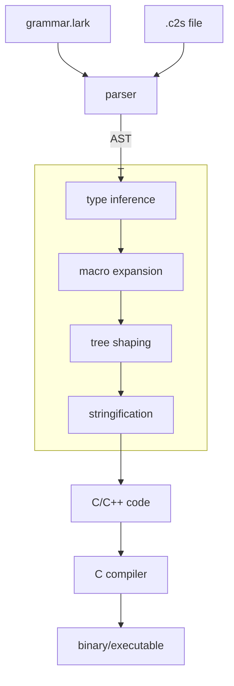

# C**

(pronounced like )

My take on a C-like programming language; main goals include pain-free macros,
comprehensive type support, object-oriented and functional style programming,
and compatibility with C and C++. This is mostly a proof of concept, so
efficiency is not a major priority; nor is completeness/usability. Wield at
your own risk.

